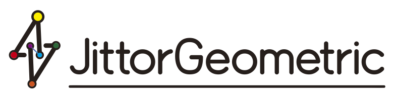

# JittorGeometric 2.0

<p align="center">
  
</p>


<div align="center">

[](https://jittor.github.io/JittorGeometric/)
[](LICENSE)
[](https://cg.cs.tsinghua.edu.cn/jittor/)
[](https://www.python.org/)

**A Comprehensive Graph Machine Learning Library Built on Jittor**

[Documentation](https://algruc.github.io/JittorGeometric/index.html) • [Examples](./examples) • [Installation](#installation) • [Quick Start](#quick-tour) • [Models](#supported-models)

</div>

---

## Overview

**JittorGeometric 2.0** is a state-of-the-art graph machine learning library built on the [Jittor](https://cg.cs.tsinghua.edu.cn/jittor/) framework. As a Chinese-developed deep learning library, JittorGeometric provides comprehensive support for Graph Neural Networks (GNNs) research and applications, featuring enhanced performance, flexibility, and scalability.

## 🌟 Key Features

### Core Capabilities
- **🚀 JIT Compilation**: Leverage Just-In-Time compilation for dynamic code modification without pre-compilation overhead
- **⚡ Optimized Sparse Operations**: High-performance sparse matrix computations with CuSparse acceleration
- **🎯 Comprehensive Model Zoo**: 40+ implemented models covering classic, spectral, dynamic, molecular, and transformer-based GNNs
- **📊 Rich Dataset Support**: Built-in loaders for popular graph datasets (Planetoid, OGB, Reddit, etc.)

### New in Version 2.0
- **🔄 Distributed Training**: Multi-GPU and multi-node training support with MPI
- **🌊 Dynamic Graph Processing**: Event-based dynamic graph support with parallel processing
- **📦 Mini-batch Support**: Efficient mini-batch training for large-scale graphs
- **🔧 ACL-GNN**: GNN for NPU
- **🎛️ Extended Model Categories**: Graph transformers, self-supervised learning, and recommendation systems

## Quick Tour

```python
### Dataset Selection
import os.path as osp
from jittor_geometric.datasets import Planetoid
import jittor_geometric.transforms as T
import jittor as jt

dataset = 'cora'
path = osp.join(osp.dirname(osp.realpath(__file__)), '.', 'data', dataset)
dataset = Planetoid(path, dataset, transform=T.NormalizeFeatures())
data = dataset[0]
v_num = data.x.shape[0]

### Data Preprocess
from jittor_geometric.ops import cootocsr,cootocsc
from jittor_geometric.nn.conv.gcn_conv import gcn_norm
edge_index, edge_weight = data.edge_index, data.edge_attr
edge_index, edge_weight = gcn_norm(
                        edge_index, edge_weight,v_num,
                        improved=False, add_self_loops=True)
with jt.no_grad():
   data.csc = cootocsc(edge_index, edge_weight, v_num)
   data.csr = cootocsr(edge_index, edge_weight, v_num)

### Model Definition
from jittor import nn
from jittor_geometric.nn import GCNConv

class GCN(nn.Module):
    def __init__(self, dataset, dropout=0.8):
        super(GCN, self).__init__()
        self.conv1 = GCNConv(in_channels=dataset.num_features, out_channels=256)
        self.conv2 = GCNConv(in_channels=256, out_channels=dataset.num_classes)
        self.dropout = dropout

    def execute(self):
        x, csc, csr = data.x, data.csc, data.csr
        x = nn.relu(self.conv1(x, csc, csr))
        x = nn.dropout(x, self.dropout, is_train=self.training)
        x = self.conv2(x, csc, csr)
        return nn.log_softmax(x, dim=1)

### Training
model = GCN(dataset)
optimizer = nn.Adam(params=model.parameters(), lr=0.001, weight_decay=5e-4) 
for epoch in range(200):
   model.train()
   pred = model()[data.train_mask]
   label = data.y[data.train_mask]
   loss = nn.nll_loss(pred, label)
   optimizer.step(loss)

```

## Supported Models

JittorGeometric 2.0 includes implementations of 40+ state-of-the-art GNN models:

### Classic Graph Neural Networks

| Model      | Year | Venue  | Description |
|------------|------|--------|-------------|
| [ChebNet](./examples/chebnet_example.py)    | 2016 | NeurIPS| Spectral graph convolutions |
| [GCN](./examples/gcn_example.py)        | 2017 | ICLR   | Graph Convolutional Networks |
| [GraphSAGE](./examples/graphsage_example.py)  | 2017 | NeurIPS| Inductive graph learning |
| [GAT](./examples/gat_example.py)        | 2018 | ICLR   | Graph Attention Networks |
| [SGC](./examples/sgc_example.py)        | 2019 | ICML   | Simplified Graph Convolution |
| [APPNP](./examples/appnp_example.py)      | 2019 | ICLR   | Approximate Personalized Propagation |
| [GCNII](./examples/gcn2_example.py)      | 2020 | ICML   | Deeper Graph Convolutional Networks |

### Spectral Graph Neural Networks

| Model      | Year | Venue  | Description |
|------------|------|--------|-------------|
| [GPRGNN](./examples/gprgnn_example.py)     | 2021 | ICLR   | Generalized PageRank GNN |
| [BernNet](./examples/bernnet_example.py)    | 2021 | NeurIPS| Bernstein polynomial filters |
| [ChebNetII](./examples/chebnet2_example.py)  | 2022 | NeurIPS| Improved Chebyshev filters |
| [EvenNet](./examples/evennet_example.py)    | 2022 | NeurIPS| Even polynomial filters |
| [OptBasis](./examples/optbasis_example.py)   | 2023 | ICML   | Optimal basis functions |

### Dynamic Graph Neural Networks

| Model      | Year | Venue  | Description |
|------------|------|--------|-------------|
| [JODIE](./examples/jodie_example.py)      | 2019 | SIGKDD | Temporal interaction networks |
| [DyRep](./examples/dyrep_example.py)      | 2019 | ICLR   | Dynamic representation learning |
| [TGN](./examples/tgn_example.py)        | 2020 | ArXiv  | Temporal Graph Networks |
| [GraphMixer](./examples/graphmixer_example.py) | 2022 | ICLR   | MLP-based dynamic graphs |
| [Dygformer](./examples/dygformer_example.py)  | 2023 | NeurIPS| Dynamic graph transformers |

### Molecular Graph Neural Networks

| Model      | Year | Venue  | Description |
|------------|------|--------|-------------|
| [SchNet](./examples/schnet_example.py)     | 2017 | NeurIPS | Continuous-filter convolutions |
| [DimeNet](./examples/dimenet_example.py)    | 2020 | ICLR   | Directional message passing |
| [EGNN](./examples/egnn_example.py)       | 2021 | ICML   | Equivariant Graph Networks |
| [Graphormer](./examples/graphormer_example.py)    | 2021 | NeurIPS   | Graph transformers for molecules |
| [SphereNet](./examples/spherenet_example.py)  | 2022 | ICLR   | Spherical message passing |
| [Uni-Mol](./examples/unimol_example.py)    | 2023 | ICLR   | Universal molecular representation |
| [Transformer-M](./examples/transformer-m_example.py)    | 2023 | ICLR   | Molecular transformers |

### Graph Self-supervised Learning

| Model                                    | Year | Venue | Description |
|------------------------------------------|------|-------|-------------|
| [DGI](./examples/dgi_example.py)         | 2019 | ICLR  | Deep Graph Infomax |
| [MVGRL](./examples/mvgrl_example.py)     | 2020 | ICML  | Multi-view contrastive learning |
| [GRACE](./examples/grace_example.py)     | 2020 | ICML  | Graph contrastive learning |
| [PolyGCL](./examples/polygcl_example.py) | 2024 | ICLR  | Polynomial graph contrastive learning |

### Graph Recommendation

| Model                                    | Year | Venue | Description |
|------------------------------------------|------|-------|-------------|
| [SASREC](./examples/sasrec_example.py)   | 2018 | ICDM  | Self-attentive sequential recommendation |
| [SGNNHN](./examples/sgnnhn_example.py)   | 2020 | CIKM  | Set-based GNN for heterogeneous networks |
| [CRAFT](./examples/craft_example.py)     | 2025 | ArXiv | Cross-attention recommendation |

### Graph Embedding

| Model                                    | Year | Venue | Description |
|------------------------------------------|------|-------|-------------|
| [Deepwalk](./examples/link_pred_example.py)   | 2014 | KDD  | Random walk embeddings |
| [LINE](./examples/link_pred_example.py)     | 2015 | WWW  | Large-scale information network embedding |
| [Node2Vec](./examples/link_pred_example.py)   | 2016 | KDD  | Scalable feature learning |
| [LightGCN](./examples/recsys_example.py)   | 2020 | SIGIR  | Simplified GCN for recommendation |
| [DirectAU](./examples/recsys_example.py)   | 2022 | KDD  | Direct alignment and uniformity |
| [SimGCL](./examples/recsys_example.py)   | 2024 | KAIS  | Simple graph contrastive learning |
| [XSimGCL](./examples/recsys_example.py)   | 2024 | TKDE  | Extreme simple graph contrastive learning |

### Graph Transformers

| Model                                    | Year | Venue | Description |
|------------------------------------------|------|-------|-------------|
| [SGFormer](./examples/sgformer_example.py)         | 2023 | NeurIPS  | Simplifying graph transformers |
| [NAGFormer](./examples/nagphormer_example.py)     | 2023 | ICLR  | Neighborhood aggregation transformers |
| [PolyFormer](./examples/polyformer_example.py)     | 2024 | KDD  | Polynomial-based graph transformers |

## Installation

### Step-by-Step Installation

1. **Create a conda environment**
   ```bash
   conda create -n jittorgeometric python=3.10
   conda activate jittorgeometric
   ```

2. **Install Jittor**
   ```bash
   python -m pip install git+https://github.com/Jittor/jittor.git
   ```
   or follow the [Jittor official documentation](https://cg.cs.tsinghua.edu.cn/jittor/).

3. **Install dependencies**
   ```bash
   pip install astunparse==1.6.3 autograd==1.7.0 cupy==13.3.0 numpy==1.24.0 \
               pandas==2.2.3 Pillow==11.1.0 PyMetis==2023.1.1 six==1.16.0 \
               pyparsing==3.2 scipy==1.15.1 setuptools==69.5.1 sympy==1.13.3 \
               tqdm==4.66.4 einops huggingface_hub==0.27.1 networkx==3.4.2 \
               scikit-learn==1.7.1 rdkit==2025.3.5 seaborn==0.13.2 \
               alive-progress==3.3.0
   ```

4. **Install JittorGeometric**
   ```bash
   git clone https://github.com/AlgRUC/JittorGeometric.git
   cd JittorGeometric
   pip install .
   ```

5. **Verify installation**
   ```bash
   python examples/gcn_example.py
   ```

### For Distributed Training (Optional)

Install MPI support:
```bash
conda install -c conda-forge openmpi=4.0.5
conda install -c conda-forge mpi4py
```

## 📋 Requirements

- Python 3.10+
- CUDA 11.0+ (for GPU support)
- Jittor 1.3.0+
- CuPy (for CUDA operations)
- NumPy, SciPy, NetworkX
- For distributed training: OpenMPI 4.0.5+ and mpi4py

## 🔄 Distributed Training

JittorGeometric 2.0 supports distributed training across multiple GPUs and nodes:

### Single Machine Multi-GPU
```bash
mpiexec -n 2 python dist_gcn.py --num_parts 2 --dataset reddit
```

### Multi-Node Training
1. Configure your hostfile:
```
172.31.195.15 slots=1
172.31.195.16 slots=1
```

2. Partition the graph:
```bash
python dist_partition.py --dataset reddit --num_parts 2 --use_gdc
```

3. Launch distributed training:
```bash
mpirun -n 2 --hostfile hostfile \
--prefix /path/to/conda/env \
python dist_gcn.py --num_parts 2 --dataset reddit
```

For detailed distributed training setup, see [examples/README.md](./examples/README.md).

## 🧪 Testing

Run the test suite:
```bash
python -m pytest jittor_geometric/tests/
```

Run a specific example:
```bash
python examples/gcn_example.py
```

## 📖 Documentation

Comprehensive documentation is available at [https://algruc.github.io/JittorGeometric/index.html](https://algruc.github.io/JittorGeometric/index.html)

## 🤝 Contributing

We welcome contributions! Please see our [Contributing Guidelines](CONTRIBUTING.md) for details.

## 📝 Citation

If you use JittorGeometric in your research, please cite:

```bibtex
@software{jittorgeometric2024,
  title = {JittorGeometric: A Comprehensive Graph Machine Learning Library},
  author = {JittorGeometric Team},
  year = {2024},
  url = {https://github.com/AlgRUC/JittorGeometric}
}
```

## 👥 Contributors

This project is actively maintained by the **JittorGeometric Team** at Renmin University of China.

### Core Team
- Project Lead: [runlin_lei@ruc.edu.cn](mailto:runlin_lei@ruc.edu.cn)
- Contributors: See [Contributors](https://github.com/AlgRUC/JittorGeometric/graphs/contributors)

## 📄 License

JittorGeometric is released under the [Apache 2.0 License](LICENSE).

## 🙏 Acknowledgments

- [Jittor Team](https://cg.cs.tsinghua.edu.cn/jittor/) for the deep learning framework
- [PyTorch Geometric](https://pytorch-geometric.readthedocs.io/) for inspiration
- All contributors and users of JittorGeometric

---

<div align="center">
  <b>If you have any questions or would like to contribute, please feel free to contact us!</b>
</div>